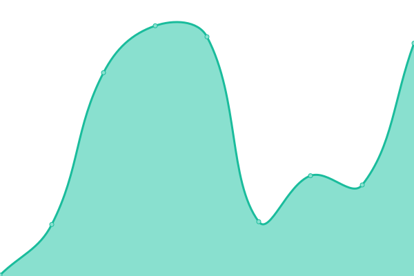

# [📈 当前状态](https://TLB-Upptime.github.io/tlb-upptime.github.io): <!--live status--> **🟩 所有系统都正常运行**

This repository contains the open-source uptime monitor and status page for [TLB-tools](https://TLB-Upptime.github.io/tlb-upptime.github.io), powered by [Upptime](https://github.com/upptime/upptime).

With [Upptime](https://upptime.js.org), you can get your own unlimited and free uptime monitor and status page, powered entirely by a GitHub repository. We use [Issues](https://github.com/TLB-Upptime/tlb-upptime.github.io/issues) as incident reports, [Actions](https://github.com/TLB-Upptime/tlb-upptime.github.io/actions) as uptime monitors, and [Pages](https://TLB-Upptime.github.io/tlb-upptime.github.io) for the status page.

## [📈 Live Status](https://demo.upptime.js.org): <!--live status--> **🟩 所有系统都正常运行**

<!--start: status pages-->
<!-- This summary is generated by Upptime (https://github.com/upptime/upptime) -->
<!-- Do not edit this manually, your changes will be overwritten -->
<!-- prettier-ignore -->
| URL | 状态 | 历史 | 响应时间 | 工作时间 |
| --- | ------ | ------- | ------------- | ------ |
|  [Wikidot](https://www.wikidot.com) | 🟩 正常 | [wikidot.yml](https://github.com/TLB-Upptime/tlb-upptime.github.io/commits/HEAD/history/wikidot.yml) | 

 154毫秒
     
 | 

<a href="https://TLB-Upptime.github.io/tlb-upptime.github.io/history/wikidot">100.00%</a>
    

|  [时间轴书店](https://timeline-bookstore.wikidot.com) | 🟩 正常 | [.yml](https://github.com/TLB-Upptime/tlb-upptime.github.io/commits/HEAD/history/.yml) | 

 182毫秒
     
 | 

<a href="https://TLB-Upptime.github.io/tlb-upptime.github.io/history/">100.00%</a>
    

|  [时间轴书店沙盒](http://tlb-sandbox.wikidot.com) | 🟩 正常 | [.yml](https://github.com/TLB-Upptime/tlb-upptime.github.io/commits/HEAD/history/.yml) | 

 182毫秒
     
 | 

<a href="https://TLB-Upptime.github.io/tlb-upptime.github.io/history/">100.00%</a>
    

|  [时间轴书店文件储存室](http://tlb-files.wikidot.com) | 🟩 正常 | [.yml](https://github.com/TLB-Upptime/tlb-upptime.github.io/commits/HEAD/history/.yml) | 

 182毫秒
     
 | 

<a href="https://TLB-Upptime.github.io/tlb-upptime.github.io/history/">100.00%</a>
    

|  [时间轴书店后台](http://tlb-command.wikidot.com) | 🟩 正常 | [.yml](https://github.com/TLB-Upptime/tlb-upptime.github.io/commits/HEAD/history/.yml) | 

 182毫秒
     
 | 

<a href="https://TLB-Upptime.github.io/tlb-upptime.github.io/history/">100.00%</a>
    

<!--end: status pages-->

[**Visit our status website →**](https://TLB-Upptime.github.io/tlb-upptime.github.io)

## 📄 License

- Powered by: [Upptime](https://github.com/upptime/upptime)
- Code: [MIT](./LICENSE) © [TLB-tools](https://TLB-Upptime.github.io/tlb-upptime.github.io)
- Data in the `./history` directory: [Open Database License](https://opendatacommons.org/licenses/odbl/1-0/)
